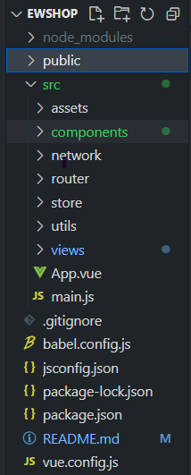
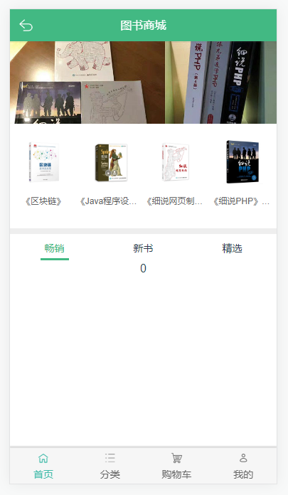
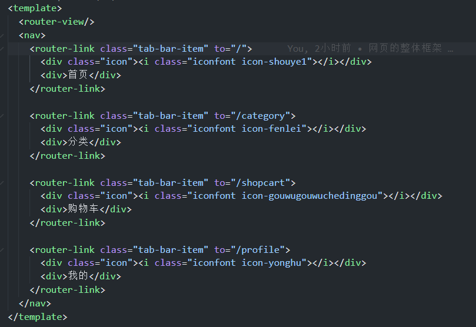
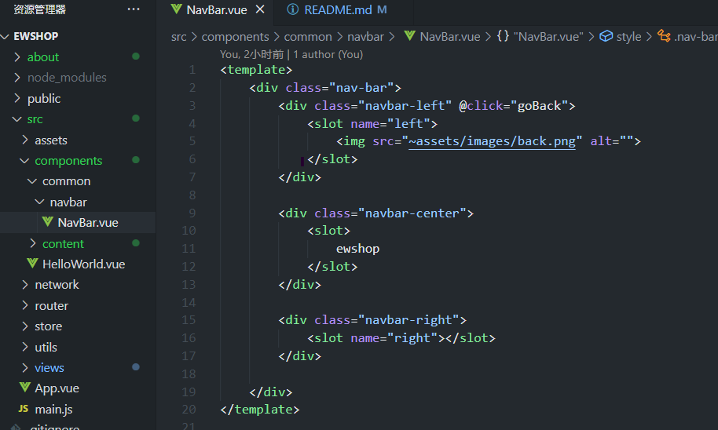
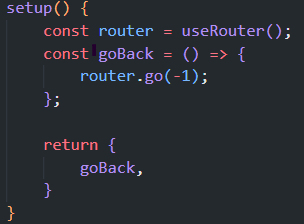
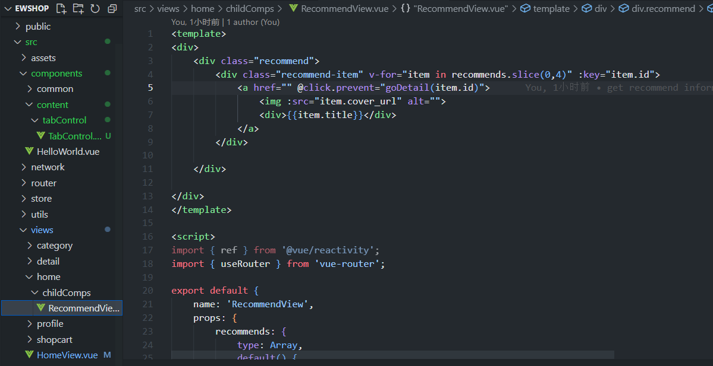
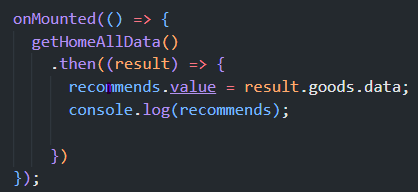
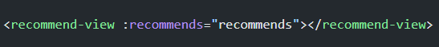
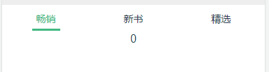

# ewshop

## Project setup
```
npm install
```

### Compiles and hot-reloads for development
```
npm run serve
```

### Compiles and minifies for production
```
npm run build
```

## used API
[click here to read document](https://www.showdoc.com.cn/1207745568269674/6094279351627422)

## steps

### about the folders

```
assets: to store various types of resources, like css, fonts, or images and so on.

components: to store small components(in size).

network: use axios to get information from server, is a special folder for js.

router: of course for routers' configuration.

store: for vuex's configuration.

utils: not now.

views: to store page level components. 
    category: the kinds of goods
    detail: page for the specific goods
    home: components for home page
    profile: page for user
    shopcart: page of shopping cart

    Homeview.vue: page of home
```
### Normalize Style
look at src/assets/css

base.css depends on normalize.css(u don't even need this) 

and the latter could be found on github(just search 'normalize')
### Layout
place guide at bottom: 首页, 分类, 购物车, 我的



[the iconfont-alibaba](https://www.iconfont.cn/)
***
each kind uses a separate component, here are code


***
but every page uses the same component for their top area:



it contains three parts: left, center, right

left is a button to the last page, click to use the function goBack



and then every page imports and uses the NavBar.vue

***
### About the Home Page
#### Carousel Chart
now just use a picture, talk about it later

#### Goods Recommend



get information from the server and send it to this component, and then show these

when click the picture, go to its detail page with sending its goods id by router.push function

***
when home page on mounted, get the information: 



the function-getHomeAllData is at folder: network/home.js

***

last picture has a variable called recommends, use function-ref() to create it

and sent it to RecommendView component



the type of the variable is Array, use props to accept and use v-for to get each data

but the place is limited and we only need four, and use splice to get them.

the code is at src/views/home/childComps/RecommendView.vue

just take a look

### Navigation for Goods


three kinds of ways to filter books: 畅销书, 新书, 精选书单

use three buttons to represent them

we need some special css for the button which is selected.

```css
/* scss */
.selected {
    color: var(--color-tint);
    span {
        border-bottom: 3px solid var(--color-tint);
    }
}

/* i'm sleepy, write the left tomorrow    ----2022/12/12 1:21am for commemorating*/
```
