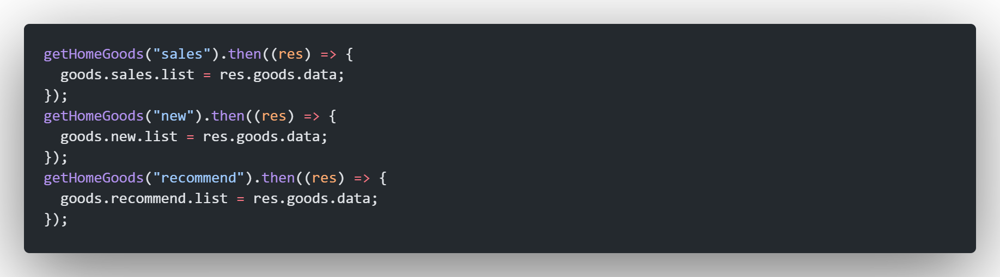

# ewshop

## Project setup
```
npm install
```

### Compiles and hot-reloads for development
```
npm run serve
```

### Compiles and minifies for production
```
npm run build
```
scorll
## used API
[click here to read document](https://www.showdoc.com.cn/1207745568269674/6094279351627422)

## steps

### about the folders

```
assets: to store various types of resources, like css, fonts, or images and so on.

components: to store small components(in size).

network: use axios to get information from server, is a special folder for js.

router: of course for routers' configuration.

store: for vuex's configuration.

utils: not now.

views: to store page level components. 
    category: the kinds of goods
    detail: page for the specific goods
    home: components for home page
    profile: page for user
    shopcart: page of shopping cart

    Homeview.vue: page of home
```
### Normalize Style
look at src/assets/css

base.css depends on normalize.css(u don't even need this) 

and the latter could be found on github(just search 'normalize')
### Layout
place guide at bottom: 首页, 分类, 购物车, 我的


[the iconfont-alibaba](https://www.iconfont.cn/)
***
each kind uses a separate component, here are code


***
but every page uses the same component for their top area:


it contains three parts: left, center, right

left is a button to the last page, click to use the function goBack


and then every page imports and uses the NavBar.vue

***
### About the Home Page
#### Carousel Chart
now just use a picture, talk about it later

#### Goods Recommend


get information from the server and send it to this component, and then show these

when click the picture, go to its detail page with sending its goods id by router.push function

***
when home page on mounted, get the information: 


the function-getHomeAllData is at folder: network/home.js

***

last picture has a variable called recommends, use function-ref() to create it

and sent it to RecommendView component


the type of the variable is Array, use props to accept and use v-for to get each data

but the place is limited and we only need four, and use splice to get them.

the code is at src/views/home/childComps/RecommendView.vue

just take a look

### Navigation for Goods


three kinds of ways to filter books: 畅销书, 新书, 精选书单

use three buttons to represent them

we need some special css for the button which is selected.

```css
/* scss */
.selected {
    color: var(--color-tint);
    span {
        border-bottom: 3px solid var(--color-tint);
    }
}

/* i'm sleepy, write the left tomorrow    ----2022/12/12 1:21am for commemorating*/
```

the component for it called TabControl.vue in this project
```
components/content/tabControl/TabControl.vue
```


use v-for for variable 'titles', clicked will trigger events('select' and 'toEmit')
if u click '新书', the event 'select' will change the variable 'currentIndex' to the number 1
and the second element(div) will have the selected class tag and get the style
```js
function select(index) {
    currentIndex.value = index;

}
```

the event 'toEmit' will give which tab was clicked and get the information from Server
```js
const toEmit = (index) => {
    emit('tabControlClicked', index);
}
```

### Get Goods When Click TabControl's choice
use this function to get data:


use this variable to storage the data and return it at setup():


when vue mounted, get the data:


we need a component to show the data
so create component: components/content/goods/GoodsList.vue
and use it at HomeView.vue
```html
<!-- html -->
<!-- by the way, give the goods data to it -->
<goods-list :goods="showGoods"></goods-list>
```

```js
// js in setup(){}
let currentType = ref("sales");     // default value is the first choice('sales')
let showGoods = computed(()=>{
    return goods[currentType.value].list;
});

return {
    showGoods
}
```

so we need to deal with every goods at component--GoodsList.vue
for someone, we need a component and deal its style
so create component: components/content/goods/GoodsListItem.vue
and use it at GoodsList.vue
through instruction v-for, show every good

```html
<!-- GoodsList.vue -->
<GoodsListItem v-for="item in goods" :key="item" :product="item"></GoodsListItem>
```

### Use Better-Scorll
install [better-scroll](https://github.com/ustbhuangyi/better-scroll)
```
npm install better-scroll --save
```

put the part needed scroll in better-scroll


use better-scroll:
```js
bscroll = new BScroll(document.querySelector(".wrapper"), {
    click: true,
    // 监听
    probeType: 3,
    // 上拉加载更多
    pullUpLoad: true,
    // api look: https://better-scroll.github.io/docs/zh-CN/guide/base-scroll-api.html
});
```

when we find there's no goods anymore:
```js
bscroll.on("pullingUp", () => {
    let page = goods[currentType.value].page+1;
    getHomeGoods(currentType.value, page).then(res=>{
        goods[currentType.value].list.push(...res.goods.data);
        goods[currentType.value].page += 1;
    })
    bscroll.finishPullUp();
    bscroll.refresh();

    console.log('当前类型: ' + currentType.value + 
                ';\n当前页数: ' + page +
                ';\n当前高度: '+ document.querySelector('.content').clientHeight);
});

```

better-scroll will block the TabControl's style 
we cannot used 'position: fixed' to fixed it at top

so we need another hidden TabControl, 
and when the true one is disappear beacuse we scroll the screen
we need to show the hidden one

```html
<!-- use v-show to hide it at first -->
<tab-control
    :titles="titles"
    @tabControlClicked="changePage"
    v-show="isTabFixed"
    ref="copyTabControl"
></tab-control>
```

```js
let isTabFixed = ref(false);

// when true TabControl is disappear, make variable: isTabFixed get true
bscroll.on("scroll", (p) => {
    // console.log(p.x, p.y);
    // console.log(banref.value.offsetHeight);
    // 当滚动值大于banref部分的时候, bs中的TabControl会移动到视线外, 此时应当显示隐藏了的TabControl
    isTabFixed.value = (-p.y > banref.value.offsetHeight);
});
```

but this makes a bug:
```
call the first TabControl A
another which is hidden at first B

when click B: from 'sales' to 'news'
A won't change

it's the other way round

```
deal with it:
no matter u click A or B, 
they will emit a event: tabControlClicked and send the index of which we clicked
and this event will trigger a function
we just need to change B in A's function or change A in B's function

to simplify it, i used the same function called changePage
(
    this function also need to change goods' category
    no matter in A's function or B's function 
    we also need to deal with the data when chose another chioce
    so use the same one
)
and use ref to get these two
```html
<!-- A -->
<tab-control
    :titles="titles"
    @tabControlClicked="changePage"
    ref="trueTabControl"
></tab-control>
<!-- B -->
<tab-control
    :titles="titles"
    @tabControlClicked="changePage"
    v-show="isTabFixed"
    ref="copyTabControl"
></tab-control>
```

```js
const changePage = (index) => {
    // ...

    copyTabControl.value.select(index); // click B to change A's choice
    trueTabControl.value.select(index); // click A to change B's choice

// ...
};
```

### BackTop Button
slide the screen up and show more goods
use the BackTop button, we can go back to the begin
create component: components/common/backtop/BackTop.vue

when click button, emit the event BTop
```js
function backtop() {
    emit('BTop');
};
```

use BackTop.vue at HomeView.vue
```html
<back-top @BTop='BTop' v-show="isBackTopShow"></back-top>
```

use the variable: isBackTopShow
control the opportunity to show this button
```js
bscroll.on("scroll", (p) => {
    // when scrolled value(the value of position to move) is more than banref's height
    // tabControl will disappear
    // and we need to show the hidden TabControl and the BackTop Button
    isTabFixed.value = (-p.y > banref.value.offsetHeight);
    isBackTopShow.value = isTabFixed.value;
});
```